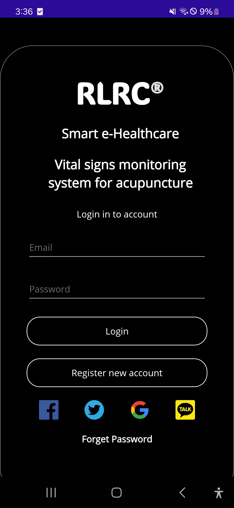
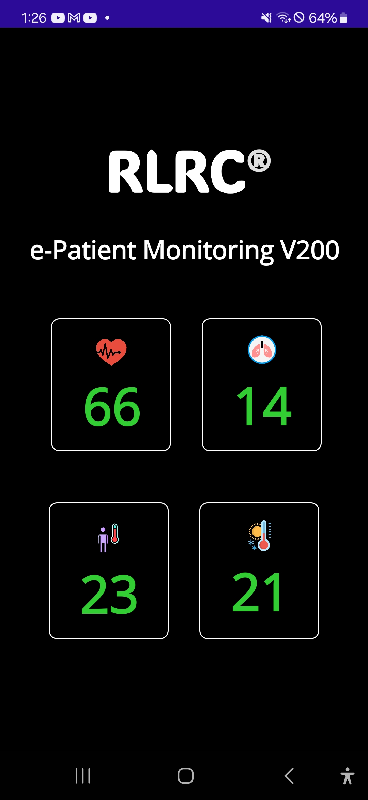

# E-Smart Healthcare App

## Introduction

**E-Smart Healthcare App** is a mobile application designed to provide intelligent health monitoring and healthcare management for users. The app focuses on tracking vital signs such as heart rate and respiration rate, and offers seamless integration with healthcare providers via modern technologies, including IoT and cloud services.

## Features

- User-friendly login and registration.
- Real-time monitoring of heart rate and respiration rate.
- Personal health dashboard with data visualization.
- Notifications and health reminders.
- Integration with IoT health devices.
- Secure communication between users and healthcare professionals.

## Screenshots

  
  

