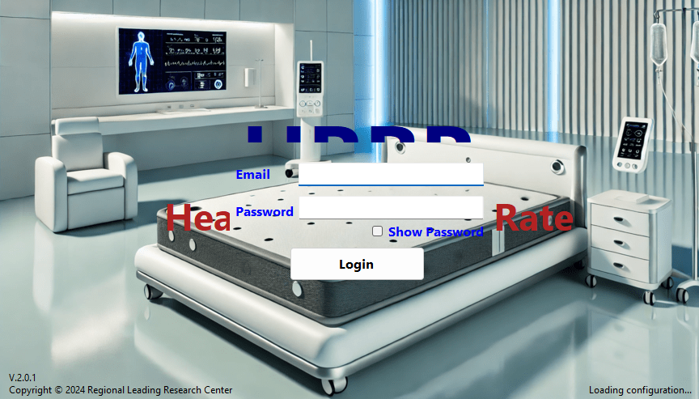
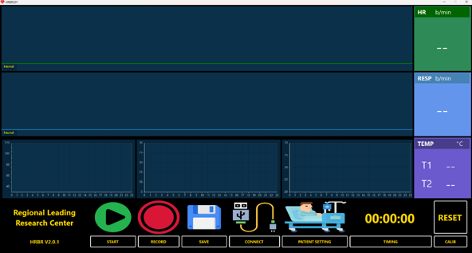

# E-Smart Healthcare Software

## Introduction

**E-Smart Healthcare Software** is a comprehensive health management platform designed for clinics, hospitals, and healthcare professionals.

## Key Features

- Secure login and multi-role user management (admin, doctor, nurse, patient).
- Real-time monitoring and visualization of vital signs (heart rate, respiration rate).
- Comprehensive patient and health record management.
- Integration with IoT medical devices for automated data collection.
- Dashboard with intuitive data visualization and statistics.
- Cloud-based data storage and backup.

## Screenshots

  

  

