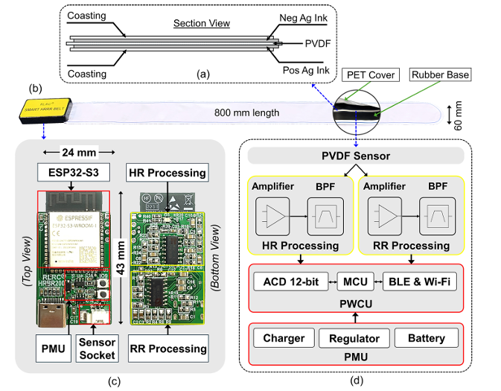

# Hardware

## Overview

This system is a wearable physiological signal monitoring device using a PVDF (Polyvinylidene fluoride) sensor strip for heart rate (HR) and respiration rate (RR) detection. The design integrates both hardware processing and wireless communication via BLE/Wi-Fi using the ESP32-S3 module.

  

## Key Features
- PVDF Sensor
- Two signal filter paths for HR and RR
- Charger, Regulator, and Battery under PMU ensure stable operation in wearable conditions.

