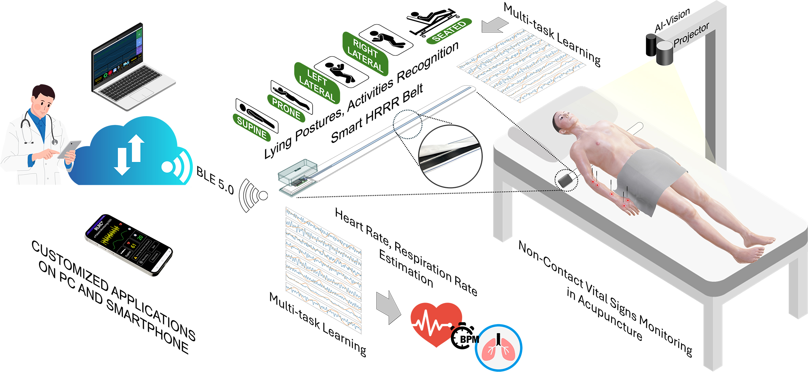

# E-Smart Health Care

## Introduction

**E-Smart Health Care** is an intelligent health monitoring system focusing on tracking heart rate and respiration rate. The project aims to connect patients, doctors, and healthcare facilities, improving healthcare efficiency through modern technology and optimized user experiences.

## Key Features

- Hardware development for collecting heart rate and respiration rate data.
- Software development for data processing and visualization.
- Mobile application for real-time health monitoring and alerts.
- IoT integration for seamless data transmission from devices to the cloud.
- Real-time heart rate and respiration rate monitoring.
- Patient and doctor management.

## Demo

[Download Video Demo](Imgs/demo.mp4)

## Contact

- **Author:** Quy Phuong Le
- **Email:** lequyphuong1903@gmail.com

---

_Thank you for your interest in this project!_
